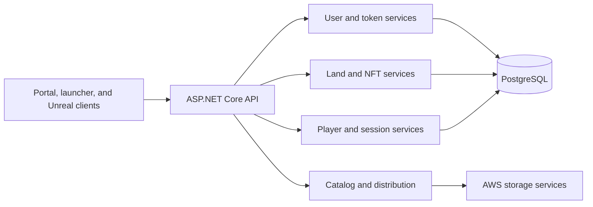

# Shib Platform Backend

Shib Platform Backend is an ASP.NET Core 8 API serving identity, digital assets, metaverse land, game distribution, and LapDogs session data across the Shib ecosystem. It provides the shared service boundary used by the web portal, desktop launcher, Unreal clients, and operational tooling.

The project organizes data into bounded Entity Framework contexts for users, the metaverse, LapDogs, NFTs, and the launcher catalog while exposing purpose-specific controller surfaces for each domain.

## Engineering scope

- Wallet and email account registration, login, profile completion, and user lookup
- JWT bearer authentication integrated with the platform identity provider
- NFT metadata retrieval and persistence support
- Metaverse land counting and plot registration workflows
- LapDogs player registration, game hosting, start, and end-of-session statistics
- Launcher catalog management, version metadata, artwork, download data, and signed storage URLs
- PostgreSQL persistence through Entity Framework Core and domain-specific migrations
- AWS S3 and DynamoDB integrations for object and metadata workflows
- OpenAPI/Swagger discovery with bearer-token support
- Environment-specific configuration for databases, identity, AWS, and hosting

## Service architecture



## API domains

| Controller | Responsibility | Representative operations |
| --- | --- | --- |
| `USERController` | Platform identity and profiles | Sign up, login, email connection, wallet lookup, profile read/write |
| `NFTController` | Digital asset data | NFT retrieval |
| `MVController` | Metaverse land | Plot counts and plot insertion |
| `LDController` | LapDogs runtime data | Player sign-up, host, start, and end-game results |
| `SLController` | Launcher catalog and delivery | Games, versions, images, downloads, metadata, and storage URLs |

## Technology

- .NET 8 and ASP.NET Core controllers
- Entity Framework Core 8 with Npgsql/PostgreSQL
- JWT bearer authentication and Auth0-compatible identity flows
- AWS SDK for S3 and DynamoDB
- Swashbuckle OpenAPI/Swagger
- WalletConnect support
- EF Core migrations split by platform domain

## Repository map

| Path | Responsibility |
| --- | --- |
| `Program.cs` | Dependency registration, persistence, auth, AWS, OpenAPI, CORS, and HTTP pipeline |
| `Controllers/` | Domain endpoints and application services |
| `Controllers/Auth/` | Token generation, authentication services, and dependency registration |
| `Controllers/DbContext/` | User, metaverse, and LapDogs persistence boundaries |
| `Controllers/Dto/` | API contracts and persistence models grouped by domain |
| `Migrations/` | Database evolution for the shared and bounded contexts |
| `.config/dotnet-tools.json` | Local .NET tooling manifest |

## Local development

### Prerequisites

- .NET 8 SDK
- PostgreSQL
- Authorized development credentials for the identity and AWS environments

Keep all real credentials outside version control. Use environment variables, `.NET` user secrets, or the team's approved secret manager for:

- `ConnectionStrings__DefaultConnection`
- identity-provider configuration
- AWS profile or workload credentials

Then restore tools and packages, apply the required migrations, and run the service:

```bash
dotnet tool restore
dotnet restore
dotnet ef database update
dotnet run
```

Swagger UI is enabled by the current application pipeline and is available from the service's `/swagger` route.

## Repository checks

Validate tracked configuration and audit the supported .NET 8 dependency graph with:

```bash
python scripts/check_repository.py
dotnet restore --nologo -p:NuGetAudit=true -p:NuGetAuditMode=all -p:NuGetAuditLevel=high "-warnaserror:NU1903;NU1904"
```

Pull requests also run secret scanning, dependency review, and no-build C# CodeQL analysis in GitHub Actions. A full application build is not part of the public CI baseline because the showcase snapshot omits several private launcher-domain source types.

## Ecosystem context

This API supports the [Shib: The Metaverse](https://github.com/Elia-Youssef/ShibTheMetaverse) Unreal client, the [desktop launcher](https://github.com/Elia-Youssef/ShibPortal-Desktop), the [web identity and streaming portal](https://github.com/Elia-Youssef/ShibPortal-Frontend), and [LapDogs](https://github.com/Elia-Youssef/LapDogs). The wider product is presented in the [Rebel Art Studios metaverse case study](https://rebelartstudios.org/project/shib-the-metaverse).

## Repository scope and licensing

This is an internal service repository and contains no open-source license. Production secrets, private infrastructure details, and customer data must not be added to distributable builds or documentation. Unless a separate agreement grants permission, the source is provided for authorized development and portfolio reference only.
